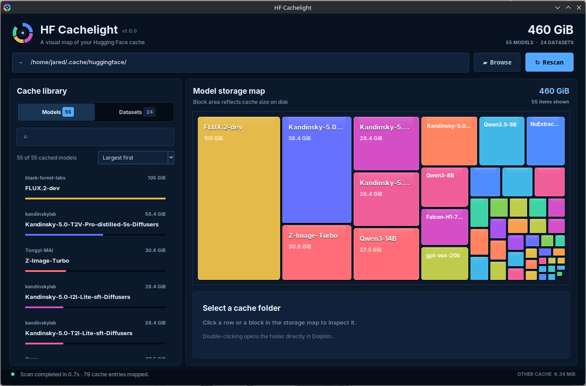

# HF Cachelight

HF Cachelight is a dependency-free desktop application for scanning and visualizing Hugging Face model and dataset caches. It provides searchable listings and an interactive treemap while remaining completely read-only.



## Features

- Visualizes cache usage with an interactive treemap
- Separates cached models and datasets
- Search and sort by size, name, or modification date
- Opens cache folders directly in Dolphin
- Runs entirely with Python's standard library
- Never deletes or modifies cache files

## Run

```bash
python main.py
```
